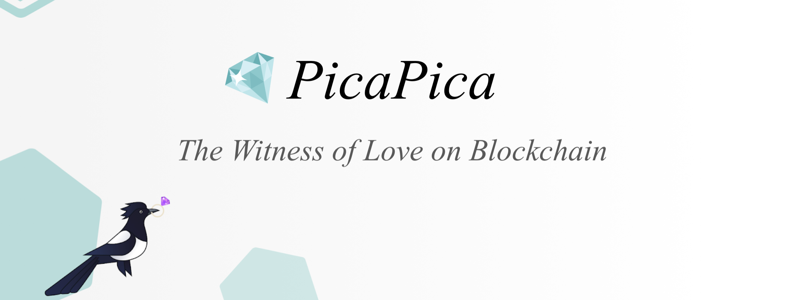

Marriage is a smart contract.

## Traditions and Symbolism
Magpie is a symbol of good luck and fortune in East Asian cultures. It is a popular subject in Chinese literature and a frequent theme in traditional Chinese poetry. In a 	Chinese folk tale, the Cowherd and the Weaver Girl, Magpies were a symbol of love and reunion. Once a year, on the 7th day of the 7th lunar month, a flock of magpies would form a bridge to reunite the lovers for one day. The tale of the Cowherd and the Weaver Girl has been celebrated in the Qixi Festival in China since the Han Dynasty. It has also been celebrated in the Tanabata festival in Japan, and in the Chilseok festival in Korea. 

## Core Value
- **Commitment**
  - PicaPica safeguards your wedding vows in a **cryptographically linked data block**, shaping the foundation of the marriage with an eternal commitment by a smart contract.
- **Memory**
  - PicaPica encapsulates your love stories as an **untamperable chain of records** and creates a sweet space for message exchange on your anniversary day.
- **Growth**
  - PicaPica encourages you to spread love to the world and help others grow by making **trackable donations** to a charity of your choice.
